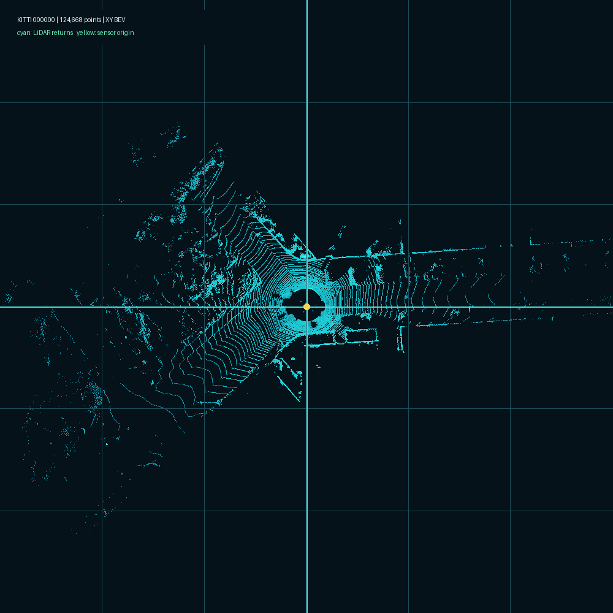
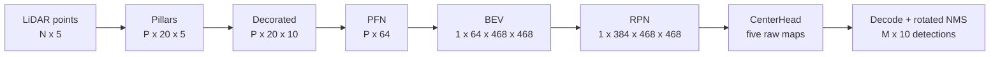

# LiDAR_recon 초보자 통합 학습 보고서

> 기준 저장소: `https://github.com/min5921/LiDAR_recon.git`  
> 분석 기준 커밋: `be012d4d065073a3e2e0e647a620abde5d535296` `[직접 실행]`  
> 목적: Python CenterPoint 기준 구현을 단계별 C++/CUDA로 검증한 뒤, 중간 파일 없이 GPU 안에서 이어지는 추론 파이프라인으로 통합한 과정을 코드와 실제 값으로 설명한다.

## 먼저 읽을 결론

이 저장소의 핵심은 새로운 검출 모델을 학습하는 일이 아니다. 외부 CenterPoint PointPillars 모델의 추론 동작을 **작은 검증 단위로 분해하고**, 각 단위를 C++ 또는 CUDA로 재작성한 다음 Python/NumPy 결과와 수치 비교하여, 최종적으로 Jetson 계열 장치를 염두에 둔 GPU-resident 구조로 옮기는 과정이다.

현재 코드에서 확인되는 흐름은 다음과 같다.

1. LiDAR 점을 고정 격자의 pillar로 묶는다.
2. 각 점에 pillar 내부 위치 정보를 붙인다.
3. Pillar Feature Network가 pillar 하나를 고정 길이 벡터로 바꾼다.
4. 벡터를 조감도 격자에 배치한다.
5. RPN backbone이 공간 문맥을 추출한다.
6. CenterHead가 중심, 높이, 크기, 회전, 클래스 점수를 예측한다.
7. decode와 rotated NMS가 최종 3D box를 만든다.
8. 단계형 구현에서 확인한 계약을 GPU-resident 통합 구현으로 다시 검증한다.



위 그림은 `00_reference/sample_data/kitti/000000.bin`을 직접 읽어 만든 XY 조감도다. 포인트는 `124,668`개이고 `[N, 4] float32` 형식이다 `[아티팩트 검산]`. 이 파일은 학습 데이터 전체가 아니라 단계 구현을 재현하기 위한 작은 입력 샘플이다.

## 검증 상태를 읽는 법

| 표시 | 의미 |
|---|---|
| `[직접 실행]` | 현재 환경에서 명령을 실행해 얻은 값 |
| `[아티팩트 검산]` | 커밋된 binary, JSON, CSV를 직접 읽어 계산한 값 |
| `[저장소 기록]` | 저장소 문서나 로그에는 있으나 이번 세션에서 전체 재실행하지 못한 값 |
| `[수식 검산]` | 코드의 shape, dtype, 공식을 독립 계산해 확인한 값 |
| `[미검증]` | 필요한 데이터, weight, 환경이 없어 확인하지 못한 값 |

상세한 기계 판독 값은 [`ACTUAL_VALUES.json`](ACTUAL_VALUES.json), 명령별 결과는 [`REPRODUCTION_LOG.md`](REPRODUCTION_LOG.md), 커밋 아티팩트의 확장 통계는 `artifact_inspection.json`에 있다.

## LiDAR와 3D 객체 검출

### LiDAR 한 점은 무엇인가

LiDAR는 레이저 왕복 시간을 이용해 센서 주변 표면의 위치를 측정한다. 이 저장소가 사용하는 점 하나의 핵심 값은 다음과 같다.

| 필드 | 의미 | 이 저장소에서의 사용 |
|---|---|---|
| `x` | 센서 좌표계의 앞/뒤 위치 | pillar의 X 격자와 box 중심 계산 |
| `y` | 센서 좌표계의 좌/우 위치 | pillar의 Y 격자와 box 중심 계산 |
| `z` | 높이 | 범위 필터, pillar feature, box 높이 계산 |
| `intensity` | 반사 강도 | PFN 입력 feature |
| `elongation` | 반사 펄스의 늘어짐 관련 Waymo feature | Waymo novelocity 모델의 PFN 입력 feature |

커밋된 KITTI 샘플은 `[124668, 4]`이고 첫 점은 `[52.8979416, 0.0229897, 1.9979945, 0.08]`이다 `[아티팩트 검산]`, 출처는 `00_reference/sample_data/kitti/000000.bin`이다. Waymo 경로는 다섯 번째 값인 elongation까지 포함한 `[N, 5]`를 사용한다 `[수식 검산]`.

### 왜 바로 3D 합성곱을 쓰지 않는가

원시 point cloud는 점의 개수와 위치가 불규칙하다. 일반적인 이미지 합성곱은 규칙적인 격자를 기대하므로, PointPillars는 XY 평면을 pillar 격자로 나누고 각 pillar를 고정 길이 feature로 바꾼다. 높이 방향을 하나의 칸으로 합치면 이후 계산을 2D 조감도 합성곱으로 처리할 수 있다.

이 저장소의 모델 공간은 다음과 같다.

| 값 | 실제 값 | 검증 상태 | 출처 |
|---|---:|---|---|
| X 범위 | `-74.88`에서 `74.88 m` | `[수식 검산]` | voxel config와 현재 코드 |
| Y 범위 | `-74.88`에서 `74.88 m` | `[수식 검산]` | voxel config와 현재 코드 |
| Z 범위 | `-2`에서 `4 m` | `[수식 검산]` | voxel config와 현재 코드 |
| voxel 크기 | `[0.32, 0.32, 6.0] m` | `[수식 검산]` | voxel config와 현재 코드 |
| 격자 크기 | `[468, 468, 1]` | `[수식 검산]` | `149.76 / 0.32 = 468`, `6 / 6 = 1` |
| pillar당 최대 점 | `20` | `[수식 검산]` | `VoxelizationConfig` |
| 최대 pillar | `60,000` | `[수식 검산]` | `VoxelizationConfig` |

`[468, 468, 1]`은 width, height, depth를 뜻한다. 파일에 쓰는 좌표 순서는 `[batch, z, y, x]`다 `[아티팩트 검산]`, 출처는 커밋된 voxel metadata와 writer 코드다.

## PointPillars와 CenterPoint의 관계

### PointPillars가 담당하는 부분

PointPillars는 다음 세 구간을 중심으로 이해하면 된다.

- **Pillar encoder**: 점을 pillar로 묶고 위치 feature를 추가한다.
- **PFN**: 각 pillar의 여러 점을 하나의 feature 벡터로 압축한다.
- **2D backbone**: BEV pseudo-image에서 넓은 공간 문맥을 계산한다.

이 저장소에서는 voxelization, pillar decoration, PFN, scatter, RPN 프로젝트가 이 역할을 단계별로 구현한다.

### CenterPoint가 추가하는 부분

CenterPoint는 객체를 3D box 모서리부터 찾는 대신, 조감도에서 객체 중심을 heatmap peak로 찾는다. CenterHead는 각 격자 칸에 대해 다음 raw map을 출력한다.

| map | 채널 | 의미 | 검증 상태 | 출처 |
|---|---:|---|---|---|
| `reg` | `2` | 격자 칸 내부의 X/Y 중심 offset | `[직접 실행]` | CenterHead 실행 출력 |
| `height` | `1` | box 중심 Z | `[직접 실행]` | CenterHead 실행 출력 |
| `dim` | `3` | log 공간의 box 크기 | `[직접 실행]` | CenterHead 실행 출력 |
| `rot` | `2` | yaw를 복원할 sine/cosine 계열 값 | `[직접 실행]` | CenterHead 실행 출력 |
| `hm` | `3` | VEHICLE, PEDESTRIAN, CYCLIST logit | `[직접 실행]` | CenterHead 실행 출력 |

이 map들은 box 자체가 아니다. decode가 `sigmoid`, `exp`, `atan2`와 격자 좌표 변환을 적용한 뒤에야 metric 단위의 box가 된다.

## 전체 tensor 흐름

원본 Mermaid 파일은 [`assets/tensor_shape_flow.mmd`](assets/tensor_shape_flow.mmd)다.



`N`은 입력 점 개수, `P`는 비어 있지 않아 선택된 pillar 개수, `M`은 NMS 뒤 남은 검출 개수다. 따라서 `N`, `P`, `M`은 frame마다 달라지고 나머지 주요 격자 shape는 모델 계약으로 고정된다.

## 저장소의 역할 구분

| 구역 | 역할 | 자체 구현 여부 | 현재 기준 |
|---|---|---|---|
| `00_reference/centerpoint_original` | 외부 CenterPoint 참조 코드 | 외부 원본 | 비교 기준이며 새 C++/CUDA 구현으로 세지 않음 |
| `00_reference/checkpoints` 계열 | 모델 checkpoint 또는 변환 전 weight 근거 | 학습 결과물 | 추론 구현과 분리 |
| `02_project`부터 `08_decode_project` | 학습용 단계별 C++/CUDA 구현 | 저장소 자체 구현 | 각 경계에서 binary dump와 Python 비교 |
| 각 프로젝트의 `tools/*.py` | 독립 NumPy 검증, weight 변환, 비교 | 저장소 자체 도구 | C++ 결과를 그대로 복사하지 않고 재계산 |
| `09_full_pipeline_project` | Waymo 입력 변환, 단계 실행 orchestration, 평가, 시각화 | 저장소 자체 Python 도구 | C++ 단일 full pipeline이 아님 |
| `10`부터 `13` 분석 프로젝트 | heatmap, 기준 구현, FN, operating point 분석 | 저장소 자체 분석 | 추론 정확도 원인과 운용 임계값 연구 |
| `14_gpu_resident_pipeline_project` | 새 통합 C++/CUDA 추론 | 저장소 자체 구현 | 단계 프로젝트를 호출하지 않는 독립 구현 |
| `000_waymo_training_project` | Waymo 파일 탐색과 학습 디렉터리 준비 | 준비 도구 | 실제 학습 loop 구현이 아님 |

`000_waymo_training_project`에는 파일 스캔 Python, 레이아웃 생성 PowerShell, README와 계획 문서만 있다 `[수식 검산]`. 학습 모델, optimizer, loss, epoch loop를 실행하는 코드가 없으므로 현재 기준은 **학습 준비 프로젝트**다. 실제 학습 완료로 설명하면 안 된다.

## git history로 본 구현 순서

| 날짜 | 커밋 | 해결한 문제 | 검증 상태 |
|---|---|---|---|
| `2026-06-23` | `b352b64` | 참조 코드와 초기 voxel/PFN 학습 단계 마련 | `[직접 실행]` git history |
| `2026-07-04` | `acbc08e`, `613b9e0`, `cb23607` | scatter/RPN, CenterHead/decode, Visual Studio voxel 프로젝트 확장 | `[직접 실행]` git history |
| `2026-07-05` | `143bcd3` | Visual Studio 프로젝트 보강 | `[직접 실행]` git history |
| `2026-07-09` | `c7a4555` | Waymo full-pipeline bridge와 시각화 추가 | `[직접 실행]` git history |
| `2026-07-12` | `1ea3317`, `b92bd06` | decode 진단과 heatmap 검증 강화 | `[직접 실행]` git history |
| `2026-07-15` | `21a7a27`, `e850dfd`, `d0510fb` | 기준 비교, FN 분석, operating point 분석 | `[직접 실행]` git history |
| `2026-07-18` | `be012d4` | GPU-resident 통합 파이프라인 추가 | `[직접 실행]` git history |

이 순서는 “먼저 모든 것을 CUDA로 작성”한 순서가 아니다. 파일 경계에서 작은 구현을 검증하고, Waymo에서 정확도 문제를 찾고, 마지막에 통합 CUDA 구현을 추가한 순서다.

## 단계별 코드 읽기

### Voxelization: 불규칙한 점을 pillar로 묶기

**진입점**: `02_project/src/main.cpp`  
**핵심 함수**: `02_project/src/voxelization.cpp`의 `voxelize_cpu()`

입력은 연속된 float32 point 배열이다. 코드는 각 축에 대해 다음 격자 좌표를 계산한다.

```text
grid_index = floor((point_coordinate - range_min) / voxel_size)
```

범위 밖 점은 버리고, 새 `(z, y, x)`를 처음 만나면 pillar 번호를 하나 만든다. 같은 pillar에 들어온 점은 입력 순서를 유지하며 최대 점 수까지만 저장한다. 최종 파일은 다음과 같다.

| 파일 | dtype/shape | 값의 의미 |
|---|---|---|
| `pillars.bin` | `[P, 20, F] float32` | pillar별 원시 점 feature, 빈 슬롯은 영 |
| `coordinates.bin` | `[P, 4] int32` | 각 pillar의 `[batch,z,y,x]` |
| `num_points.bin` | `[P] int32` | 실제로 채워진 점 수 |
| `metadata.json` | JSON | shape와 geometry 계약 |

커밋된 KITTI dump에서 `P=10,404`, `F=4`, `pillars.bin=3,329,280 bytes`다 `[아티팩트 검산]`. `10,404 × 20 × 4 × 4 bytes = 3,329,280 bytes`도 일치한다 `[수식 검산]`.

이번 재실행은 원본 feature가 네 개인 경로와 elongation 영 값을 추가한 다섯 feature 경로를 모두 확인했다. 두 경로 모두 point `124,668`개와 pillar `10,404`개를 만들었고 Python과 좌표, 점 수, pillar 값이 정확히 같았다 `[직접 실행]`.

### Pillar decoration: 점에 상대 위치를 붙이기

**진입점**: `03_pillar_feature_project/src/main.cpp`  
**핵심 함수**: `03_pillar_feature_project/src/pillar_feature.cpp`의 `decorate_pillars_cpu()`

각 점의 원시 feature 뒤에 다음 다섯 값을 붙인다.

```text
x - mean_x, y - mean_y, z - mean_z,
x - pillar_center_x, y - pillar_center_y
```

앞의 세 값은 pillar 안 점들의 군집 중심을 알려 주고, 뒤의 두 값은 현재 점이 격자 칸 중심에서 얼마나 떨어졌는지 알려 준다. 따라서 Waymo 입력 feature가 다섯 개이면 decorated feature는 열 개다 `[수식 검산]`.

이번 직접 실행에서 `[10404,20,5]`가 `[10404,20,10]`으로 바뀌었고 NumPy 결과와 최대 절대 오차가 `0`이었다 `[직접 실행]`. 커밋된 옛 KITTI dump는 네 feature 입력이므로 decorated 차원이 아홉이다 `[아티팩트 검산]`. 둘은 서로 모순이 아니라 입력 schema 차이다.

### PFN: pillar 하나를 벡터 하나로 압축하기

**진입점**: `04_pfn_project/src/main_checkpoint.cpp`  
**핵심 함수**: `04_pfn_project/src/pfn_two_layer.cpp`의 `run_two_layer_pfn_cpu()`

Checkpoint PFN은 다음 순서로 동작한다.

1. 각 점의 decorated feature에 선형 변환, batch normalization, ReLU를 적용한다.
2. pillar 안 점 방향 max pooling으로 local context를 얻는다.
3. 점 feature와 local context를 이어 다음 PFN layer에 넣는다.
4. 다시 max pooling하여 pillar당 채널 벡터 하나를 만든다.

현재 novelocity weight 계약은 첫 계층 `10 → 32`, concat 뒤 둘째 계층 `64 → 64`, 최종 출력 `[P,64]`다 `[직접 실행]`.

| 확인 항목 | 값 | 검증 상태 | 출처 |
|---|---:|---|---|
| 출력 shape | `[10404,64]` | `[직접 실행]` | checkpoint PFN 재실행 |
| Python allclose | `true` | `[직접 실행]` | NumPy 비교 도구 |
| 최대 절대 오차 | `2.86e-6` | `[직접 실행]` | NumPy 비교 도구 |
| 평균 절대 오차 | `8.0e-8` | `[직접 실행]` | NumPy 비교 도구 |
| CPU 단일 실행 시간 | `3615.995 ms` | `[직접 실행]` | 이번 한 번의 실행, benchmark 아님 |

주의할 점이 있다. `04_pfn_project/dump/kitti_000000_pfn`의 커밋된 binary는 `src/main.cpp`의 deterministic dummy weight 결과다 `[아티팩트 검산]`. 실제 checkpoint PFN 결과로 오해하면 안 된다. Checkpoint 경로는 별도 weight 디렉터리가 필요하며 이번에는 로컬 git-ignored weight를 사용했다 `[직접 실행]`.

### BEV scatter: sparse pillar를 dense pseudo-image로 배치하기

**진입점**: `05_scatter_project/src/main.cpp`  
**핵심 함수**: `05_scatter_project/src/scatter.cpp`의 `scatter_pillars_cpu()`

PFN 결과의 pillar 행과 `coordinates.bin`의 같은 행은 한 쌍이다. scatter는 `(y,x)` 위치에 `64`채널 벡터를 복사해 NCHW 배열을 만든다. 메모리 offset은 다음과 같다.

```text
((batch * channels + channel) * height + y) * width + x
```

이번 실행 결과는 입력 `[10404,64]`, 출력 `[1,64,468,468]`, occupied cell `10,404`였고 NumPy 결과와 byte 수준으로 같았다 `[직접 실행]`.

### RPN backbone: 여러 해상도의 공간 문맥 만들기

**진입점**: `06_rpn_project/src/main_full.cpp`  
**핵심 함수**: `06_rpn_project/cuda/rpn_full_cuda.cu`의 `run_full_rpn_cuda()`

RPN은 세 해상도에서 feature를 추출하고 각 결과를 같은 해상도로 upsample한 뒤 channel 방향으로 합친다.

| 경로 | block 출력 | deblock 출력 | 검증 상태 | 출처 |
|---|---|---|---|---|
| 첫 경로 | `[1,64,468,468]` | `[1,128,468,468]` | `[직접 실행]` | 현재 CUDA 실행 |
| 둘째 경로 | `[1,128,234,234]` | `[1,128,468,468]` | `[직접 실행]` | 현재 CUDA 실행 |
| 셋째 경로 | `[1,256,117,117]` | `[1,128,468,468]` | `[직접 실행]` | 현재 CUDA 실행 |
| concat | 해당 없음 | `[1,384,468,468]` | `[직접 실행]` | 현재 CUDA 실행 |

현재 구현은 CUDA im2col, cuBLAS SGEMM, batch normalization/ReLU, transposed convolution, concat으로 구성된다. 선택 위치를 NumPy로 재계산한 검사는 모두 통과했고 확인된 선택값 중 가장 큰 절대 오차는 `2.21e-6`이었다 `[직접 실행]`.

### CenterHead: 중심 기반 raw prediction map 만들기

**진입점**: `07_center_head_project/src/main.cpp`  
**핵심 함수**: `07_center_head_project/cuda/center_head_cuda.cu`의 `run_center_head_cuda()`

입력 `[1,384,468,468]`에 shared convolution을 적용하고, 다섯 branch가 각각 `reg`, `height`, `dim`, `rot`, `hm`을 만든다. Novelocity checkpoint이므로 velocity branch는 없다 `[수식 검산]`.

이번 실행의 선택 위치 NumPy 비교 최대 절대 오차는 `3.5762787e-7`이었다 `[직접 실행]`. 이 단계의 파일은 아직 최종 박스가 아니므로 heatmap이 낮은지, decode가 잘못됐는지를 분리해서 진단할 수 있다.

### Decode와 rotated NMS: raw map을 최종 box로 바꾸기

**진입점**: `08_decode_project/src/main.cpp`  
**핵심 함수**: `08_decode_project/cuda/decode_cuda.cu`의 `decode_and_nms()`

격자 칸 `(grid_x, grid_y)`에서 box를 복원하는 핵심 공식은 다음과 같다.

```text
score = sigmoid(max_class_logit)
x = (grid_x + reg_x) * 0.32 - 74.88
y = (grid_y + reg_y) * 0.32 - 74.88
z = height
(dx, dy, dz) = exp(dim)
yaw = atan2(rot_sin, rot_cos)
```

그 뒤 점수순 후보에 rotated BEV IoU를 적용해 겹치는 box를 억제한다. 출력 CSV 열은 다음 순서다.

```text
x,y,z,dx,dy,dz,yaw,score,label,source_index
```

`label`은 `0=VEHICLE`, `1=PEDESTRIAN`, `2=CYCLIST`다 `[수식 검산]`. `source_index`는 raw map의 평면 index이며 `y = source_index / 468`, `x = source_index % 468`로 원래 칸을 찾는 디버깅 키다 `[수식 검산]`.

| 실행 설정 | 후보 | 최종 검출 | Python 비교 | 검증 상태 |
|---|---:|---:|---|---|
| legacy 기본값: score `0.1`, NMS `0.7`, `current` | `811` | `500` | 최대 오차 `7.62816163e-6`, 통과 | `[직접 실행]` |
| 운영 설정: score `0.35`, NMS `0.5`, `pcdet` | `54` | `20` | 기존 validator와 설정 불일치 | `[직접 실행]` |

운영 설정 결과가 잘못됐다는 뜻은 아니다. `validate_reference.py`가 score `0.1`, NMS `0.7`, `current`를 코드 내부에 고정해 운영 인자를 읽지 않기 때문에 `(실제 20행, 기대 500행)` assertion으로 실패했다 `[직접 실행]`. 현재 운영 설정 검증에는 인자를 받는 `14_gpu_resident_pipeline_project/tools/validate_gpu_detections.py` 방식이 더 적합하다.

## binary, JSON, CSV를 읽는 법

### binary는 metadata와 함께 읽어야 한다

`.bin`에는 dtype과 shape header가 없다. 다음 절차가 필요하다.

1. 대응하는 metadata JSON 또는 코드 계약에서 dtype과 shape를 찾는다.
2. `파일 bytes = shape 원소 수 × dtype bytes`를 검산한다.
3. NumPy `fromfile()` 뒤 정확한 shape로 reshape한다.

예를 들어 커밋된 voxel pillar 파일은 `[10404,20,4] float32`다 `[아티팩트 검산]`. 원소 수와 float32의 `4 bytes`를 곱하면 실제 파일 크기 `3,329,280 bytes`가 된다 `[수식 검산]`.

### JSON은 계산 계약과 provenance를 담는다

이 저장소의 JSON은 크게 세 종류다.

- tensor metadata: shape, feature 순서, 좌표 순서
- 실행 contract: 입력 archive, preprocessing, decode 설정, hash
- 분석 결과: TP/FP/FN, threshold sweep, FN 원인

경로 문자열은 과거 Windows 환경을 기록한 provenance이지 현재 위치를 보장하지 않는다. 반면 shape, hash, metric 값은 그 실행을 재현하거나 검산하는 근거다.

### CSV는 행 단위 결과를 담는다

`detections.csv`는 box 한 개가 한 행이다. FN 분석 CSV는 놓친 정답 한 개가 한 행이고, threshold summary CSV는 임계값 한 개가 한 행이다. CSV의 metric은 JSON과 독립적으로 다시 계산해야 기록 손상을 잡을 수 있다.

이번 분석 도구는 운영점 CSV 전 행의 precision, recall, F1을 다시 계산했고 모두 저장값과 일치했다 `[아티팩트 검산]`.

## Python 기준과 C++/CUDA를 비교한 방법

이 저장소의 검증 패턴은 “최종 BEV 그림이 비슷하다”보다 강하다.

| 단계 | 독립 비교 대상 | 통과 조건의 예 |
|---|---|---|
| Voxelization | 좌표, pillar 점 수, 전체 pillar 값 | exact equality |
| Decoration | 모든 decorated feature | exact 또는 tight allclose |
| PFN | NumPy 선형/BN/ReLU/max 재계산 | max/mean abs diff |
| Scatter | 전체 NCHW BEV | exact equality |
| RPN | layer probe 또는 선택 위치 NumPy 계산 | tolerance 안의 모든 probe |
| CenterHead | branch별 선택 위치 또는 probe | tolerance 안의 모든 값 |
| Decode/NMS | 후보 identity, box 숫자, 순서, 값 | 행 수와 source index, 수치 비교 |

부동소수점 GPU 연산은 합산 순서와 FMA 때문에 완전 동일하지 않을 수 있다. 따라서 구조적 값은 exact equality로, 합성곱 값은 명시적 tolerance의 allclose로 비교한다. 단, tolerance를 넓혀 실패를 숨기지 않고 max absolute difference를 함께 기록하는 것이 중요하다.

## Waymo 입력 변환과 평가

### Waymo archive에서 모델 입력까지

`09_full_pipeline_project/tools/export_waymo_frame.py`는 archive schema를 읽고 여러 LiDAR와 return의 점을 결합한다. 모델 입력 순서는 `[x,y,z,intensity,elongation]`이다 `[수식 검산]`. 참조 CenterPoint와 맞추려면 intensity에 `tanh`를 적용하는지가 중요하다.

`09_full_pipeline_project`의 CMake target `waymo_frame_inspect`는 export 파일을 검사하는 C++ 도구다. 실제 전체 단계 orchestration은 `run_waymo_multiframe_eval.py`가 voxelization, decoration, PFN, scatter, RPN, CenterHead, decode 실행 파일을 순서대로 호출한다. 따라서 프로젝트 이름만 보고 “통합 C++ pipeline”이라고 부르면 실제 구조와 다르다.

### detection 평가의 TP, FP, FN

- TP: 예측과 정답의 클래스가 맞고 IoU 기준을 통과한 일대일 match
- FP: 어느 정답에도 match되지 않은 예측
- FN: 어느 예측에도 match되지 않은 정답
- precision: `TP / (TP + FP)`
- recall: `TP / (TP + FN)`
- F1: precision과 recall의 조화평균

다섯 Waymo frame 비교는 intensity 전처리가 정확도에 미치는 영향을 보여 준다.

| 입력 intensity | 예측 | TP | FP | FN | Precision | Recall | 검증 상태 | 출처 |
|---|---:|---:|---:|---:|---:|---:|---|---|
| raw | `14` | `12` | `2` | `25` | `0.8571` | `0.3243` | `[아티팩트 검산]` | project 11 JSON, 공식 재계산 |
| `tanh` | `28` | `25` | `3` | `12` | `0.8929` | `0.6757` | `[아티팩트 검산]` | project 11 JSON, 공식 재계산 |

즉 같은 weight라도 입력 normalization 계약이 다르면 heatmap score와 recall이 크게 바뀐다. 이 사례에서는 raw 경로가 모델이 학습 때 기대한 scale과 달랐고, `tanh` 참조 경로가 Python 원본과 일치하는 기준이 됐다 `[아티팩트 검산]`.

### 놓친 객체를 어떻게 해석했는가

다섯 frame의 `tanh` 기준 FN은 `12`개다 `[아티팩트 검산]`. 분류 결과는 다음과 같다.

| 원인 | 개수 | 의미 | 검증 상태 | 출처 |
|---|---:|---|---|---|
| `LOW_MODEL_SCORE` | `9` | 정답 근처 heatmap 응답이 운영 임계값보다 낮음 | `[아티팩트 검산]` | project 12 JSON |
| `LOW_POINT_COUNT` | `3` | 유효 point가 매우 적어 모델 근거가 부족함 | `[아티팩트 검산]` | project 12 JSON |

FN 정답 box 안 유효 point 통계는 최소 `0`, 중앙값 `6`, 평균 `6.8333`, 최대 `16`이었다 `[아티팩트 검산]`. 이 결과는 decode 오류만 의심해서는 안 되고, 센서 거리와 point 밀도, heatmap score를 함께 봐야 함을 보여 준다.

### operating point는 무엇인가

Score threshold를 낮추면 recall은 오르기 쉽지만 FP가 늘고, 높이면 precision은 오르기 쉽지만 FN이 늘어난다. 커밋된 project 13 결과는 Waymo `198` frame과 label `4,337`개를 사용한다 `[아티팩트 검산]`.

| 기준 | threshold | Precision | Recall | F1 | 검증 상태 | 출처 |
|---|---:|---:|---:|---:|---|---|
| 최고 F1 | `0.30` | `0.9114` | `0.6329` | `0.7470` | `[아티팩트 검산]` | JSON/CSV 공식 재계산 |
| precision `0.8` 이상에서 최고 recall | `0.25` | `0.8400` | `0.6502` | `0.7330` | `[아티팩트 검산]` | JSON/CSV 공식 재계산 |
| 기존 비교 설정 | `0.35` | `0.9478` | `0.6154` | `0.7463` | `[아티팩트 검산]` | JSON/CSV 공식 재계산 |

저장소가 선택한 운영 threshold는 `0.25`다 `[아티팩트 검산]`. 이것은 보편적인 정답이 아니라 “precision을 최소 `0.8`로 유지하면서 recall을 가장 크게”라는 정책에 따른 선택이다.

## 단계형 파이프라인과 GPU-resident 통합 파이프라인

원본 비교 도식은 [`assets/pipeline_staged_vs_gpu_resident.mmd`](assets/pipeline_staged_vs_gpu_resident.mmd)다.

| 관점 | 단계형 구현 | GPU-resident 통합 구현 |
|---|---|---|
| 목적 | 각 알고리즘과 tensor 계약을 이해하고 검증 | 실행 중 host 왕복과 중간 파일 제거 |
| 실행 단위 | 여러 C++/CUDA 실행 파일과 Python orchestration | 하나의 `centerpoint_gpu_full` 실행 파일 |
| 중간 데이터 | pillar, decorated, PFN, BEV, RPN, head dump | device pointer로 전달 |
| NMS | staged decode의 CUDA decode 뒤 C++ CPU rotated NMS | CUDA rotated NMS |
| 검증 | 파일 전체 또는 단계별 probe | validation 모드에서 작은 probe와 pre-NMS만 복사 |
| production 출력 | 단계 디렉터리와 최종 CSV | 최종 `detections.csv`, `summary.json` |

`14_gpu_resident_pipeline_project/src/main_full.cpp`는 point를 한 번 읽고 다음 객체를 직접 연결한다.

```text
GpuPreprocessPipeline.device_bev()
  -> GpuRpnPipeline.device_output()
  -> GpuCenterHeadPipeline.device_maps()
  -> GpuPostprocessPipeline
  -> copy_detections_to_host()
```

Production 경로는 중간 tensor file을 만들지 않는다. validation 모드에서만 head probe와 pre-NMS 후보를 host로 복사한다 `[수식 검산]`.

### 이번에 직접 확인한 GPU-resident 한 frame

로컬에 존재하던 Waymo frame과 git-ignored weight를 사용해 frame 하나를 직접 재실행했다. 이 데이터와 weight는 저장소에 커밋되어 있지 않으므로 fresh clone만으로 같은 명령을 실행할 수 없다는 제한이 있다.

| 확인 항목 | 값 | 검증 상태 | 출처 |
|---|---:|---|---|
| 입력 point | `183,680` | `[직접 실행]` | GPU preprocess 실행 |
| 범위 내 유효 point | `183,505` | `[직접 실행]` | Python/GPU preprocess 비교 |
| 선택 pillar | `9,529` | `[직접 실행]` | GPU preprocess 실행 |
| BEV Python 최대 오차 | `6.20e-6` | `[직접 실행]` | full BEV 비교 |
| RPN probe | `38/38` 통과, 최대 `6.85453415e-7` | `[직접 실행]` | GPU RPN probe 비교 |
| CenterHead probe | `22/22` 통과, 최대 `3.81469727e-6` | `[직접 실행]` | GPU head probe 비교 |
| pre-NMS decode | `28/28`, 최대 `8.92439954e-6` | `[직접 실행]` | GPU detection validator |
| GPU NMS | `5/5`, 최대 `0` | `[직접 실행]` | Python NMS 비교 |
| 기존 단계형 최종 결과 | `5/5`, 최대 `7.15e-6` | `[직접 실행]` | reference detection 비교 |
| 중간 tensor 파일 | `0` | `[직접 실행]` | 실행 summary와 출력 디렉터리 |

저장소의 다섯 frame 통합 검증 문서는 RPN probe `190/190`, CenterHead probe `110/110`, decode 후보 `143/143`, 최종 detection `28/28` 통과를 기록한다 `[저장소 기록]`. 이번 세션에서는 그중 frame 하나만 독립 재실행했으므로 다섯 frame 전체 값을 `[직접 실행]`으로 올리지 않았다.

## 문서와 현재 코드가 다른 지점

### Decode 기본값과 운영값

- 문서/legacy validator: score `0.1`, NMS IoU `0.7`, `current` `[수식 검산]`
- Waymo 운영 분석: score `0.35` 또는 sweep 결과 `0.25`, NMS IoU `0.5`, `pcdet` `[아티팩트 검산]`
- 현재 기준: 실행 contract의 명시적 인자를 우선하고, validator도 같은 인자를 받아야 한다.

차이는 프로젝트가 Waymo 좌표계와 운영점 분석을 진행하면서 인자가 확장됐지만 초기 validator가 갱신되지 않았기 때문으로 보인다. 이 변경 이유 자체는 commit message에 명시되지 않아 `[미검증]`이다.

### 커밋된 PFN dump의 성격

- 파일만 보면 shape `[10404,64]`의 PFN 결과다 `[아티팩트 검산]`.
- 현재 코드에는 dummy PFN 진입점과 checkpoint PFN 진입점이 따로 있다.
- 커밋 history와 파일 위치를 함께 보면 해당 dump는 dummy 경로 결과다 `[아티팩트 검산]`.
- 현재 모델 정확도 기준은 checkpoint PFN 경로다.

### `09_full_pipeline_project`라는 이름

- 이름은 full pipeline이지만 CMake의 C++ target은 frame inspector다.
- 단계별 전체 추론은 Python이 여러 실행 파일을 호출한다.
- 실제 단일 C++/CUDA GPU-resident full pipeline은 project 14다.

### `000_waymo_training_project`라는 이름

- README는 학습 workspace를 목표로 설명한다 `[저장소 기록]`.
- 현재 파일은 scan/layout/plan뿐이며 training loop가 없다.
- 현재 기준은 데이터 변환과 학습 준비다.

## 빌드와 실행에서 겪은 시행착오

현재 Windows 환경에서 기본 Visual Studio CMake configure는 환경 변수에 `PATH`와 `Path`가 함께 존재해 MSBuild가 중복 key 예외를 내며 실패했다 `[직접 실행]`. 원본 파일을 고치지 않고 Visual Studio developer environment를 불러온 뒤 Ninja generator와 bundled Ninja 경로를 명시해 우회했다 `[직접 실행]`.

CUDA build에는 코드페이지 `949`에서 CUDA header 문자를 표시할 수 없다는 `C4819` 경고가 다수 발생했다 `[직접 실행]`. target link와 실행은 성공했으므로 이번 정확도 검증에서는 비치명 빌드 경고로 분류했다. 소스 인코딩이나 경고 정책을 바꾸는 것은 보고서 범위를 벗어나 원본을 수정하지 않았다.

RPN NumPy 선택값 검증은 CPU에서 여러 convolution을 다시 계산해 오래 걸렸지만 종료 코드 `0`과 모든 선택값 통과를 확인한 뒤 다음 단계로 진행했다 `[직접 실행]`.

## 초보자가 코드를 공부하는 권장 순서

1. `02_project/src/voxelization.cpp`에서 point 한 개가 어떤 pillar index로 가는지 손으로 계산한다.
2. 커밋된 `metadata.json`, `coordinates.bin`, `num_points.bin`을 `report_tools/inspect_outputs.py`로 읽는다.
3. `03_pillar_feature_project/src/pillar_feature.cpp`에서 cluster offset과 center offset의 차이를 확인한다.
4. `04_pfn_project/src/pfn_two_layer.cpp`에서 점 방향 max pooling이 pillar 벡터를 만드는 과정을 따라간다.
5. `05_scatter_project/src/scatter.cpp`에서 `[P,64]`가 NCHW BEV가 되는 offset을 계산한다.
6. RPN shape만 먼저 추적하고, im2col/cuBLAS 세부 구현은 그 다음에 읽는다.
7. CenterHead의 다섯 raw map과 decode CSV 열을 연결한다.
8. Waymo에서 intensity `tanh`, yaw convention, score threshold가 왜 결과를 바꾸는지 project 11부터 project 13의 JSON으로 확인한다.
9. 마지막에 project 14의 device pointer 연결을 단계형 파일 계약과 대조한다.

## 재현 가능한 실행을 위한 최소 계약

### 저장소만으로 가능한 검증

- git history와 CMake target 조사
- 커밋된 KITTI sample의 voxelization/decoration 아티팩트 검산
- CPU/CUDA source와 metadata shape 공식 검산
- project 10부터 project 13의 커밋 JSON/CSV metric 재계산
- 관련 Python unit test 실행

### 추가 로컬 자산이 있어야 가능한 검증

- checkpoint PFN, RPN, CenterHead 실제 실행: 변환 weight 필요
- Waymo frame export와 정답 평가: Waymo derived archive 필요
- GPU-resident full 실행: CUDA 지원 GPU와 통합 weight root 필요

이번 환경에는 필요한 로컬 weight, CUDA GPU, Waymo frame 일부가 있어 한 frame 통합 검증까지 직접 수행했다. 이 자산은 git tracked가 아니므로 경로와 제한을 재현 로그에 분명히 남겼다.

## 아직 미검증인 것

| 항목 | 상태 | 이유 |
|---|---|---|
| Jetson Orin Nano 실제 end-to-end latency와 메모리 | `[미검증]` | 현재 실행 장치는 RTX 5080이며 Jetson이 아님 |
| Jetson용 CUDA architecture와 cross-compile | `[미검증]` | 현재 CMake는 RTX 5080의 architecture `120` 설정 |
| Waymo 공식 evaluator의 mAP/mAPH 재실행 | `[미검증]` | 저장소 분석은 자체 BEV IoU match 중심이며 공식 evaluator 전체를 이번 세션에서 실행하지 않음 |
| `198` frame 전체 GPU-resident 재실행 | `[미검증]` | 커밋된 compact 분석 결과는 검산했지만 통합 CUDA 실행은 한 frame만 수행 |
| 실제 모델 training 완료 | `[미검증]` | training project가 준비 단계이며 학습 실행 코드/로그가 없음 |

## 결론

이 저장소는 PointPillars/CenterPoint 추론을 이해하기 쉬운 파일 경계로 분해해 C++/CUDA로 옮기고, Python 기준과 수치 비교를 축적한 뒤 GPU-resident 구현으로 통합한 학습 및 최적화 기록이다. 가장 중요한 성과는 단순히 CUDA kernel 수가 늘어난 것이 아니라, voxel 좌표, decorated feature, PFN, BEV, RPN, head, decode/NMS까지 **각 경계의 의미와 검증 방법이 만들어졌다는 점**이다.

다음 실무 단계는 이 정확도 계약을 유지하면서 Jetson Orin Nano용 architecture, 메모리 사용량, kernel launch, workspace, end-to-end latency를 계측하는 것이다. 그때도 RTX 단일 실행 시간을 Jetson 성능처럼 해석하지 말고, warm-up과 반복 수, percentile, power mode를 명시한 별도 benchmark contract가 필요하다.

## 참고 자료

- Alex H. Lang 외, [PointPillars: Fast Encoders for Object Detection from Point Clouds](https://arxiv.org/abs/1812.05784)
- Tianwei Yin 외, [Center-based 3D Object Detection and Tracking](https://arxiv.org/abs/2006.11275)
- 저장소 내부 원본 참조: `00_reference/centerpoint_original`
- 실행 근거: [`REPRODUCTION_LOG.md`](REPRODUCTION_LOG.md)
- 기계 판독 수치: [`ACTUAL_VALUES.json`](ACTUAL_VALUES.json)
- 아티팩트 분석기: [`../report_tools/inspect_outputs.py`](../report_tools/inspect_outputs.py)
